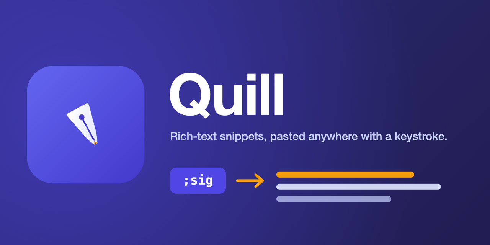
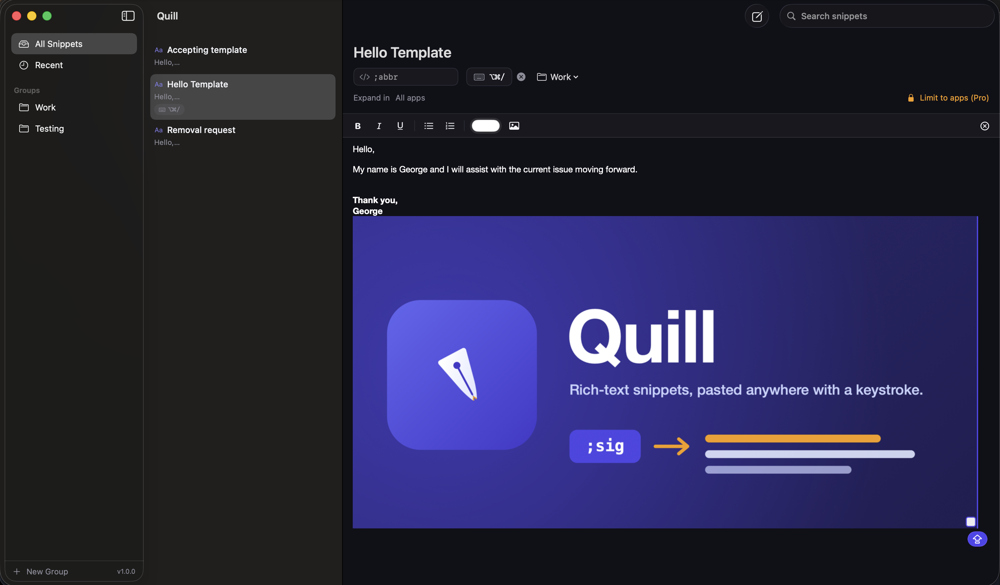
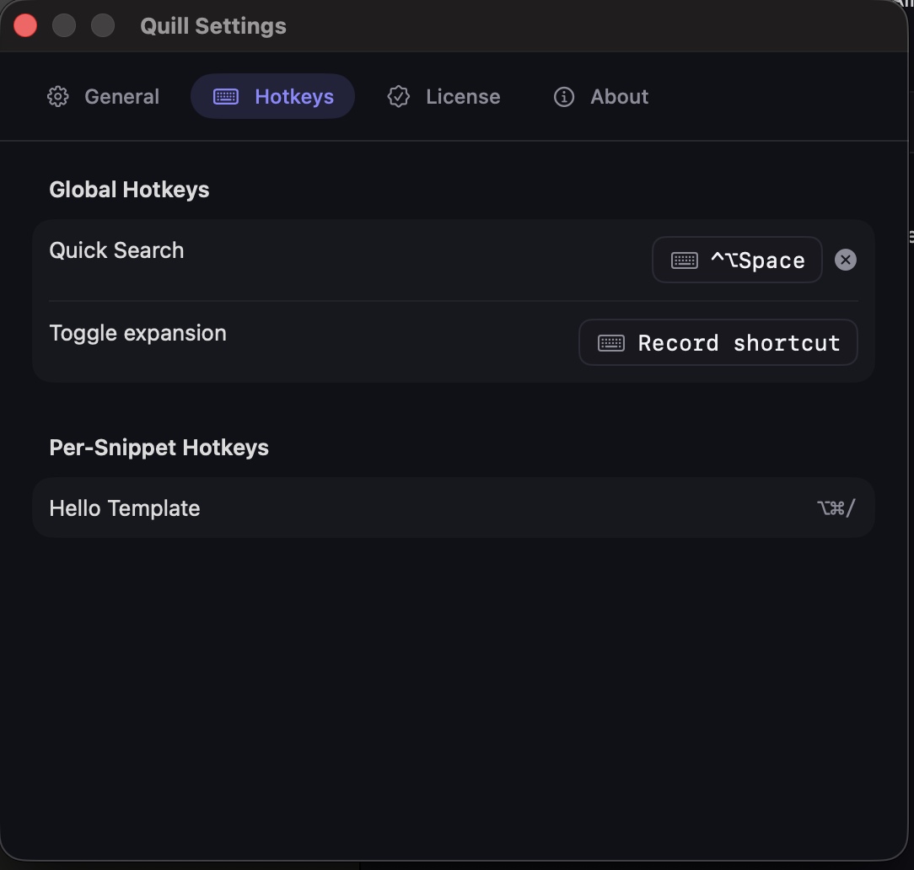

  

  <strong>Rich-text snippets, pasted anywhere with a keystroke</strong> 
  Type a short abbreviation or press a hotkey — Quill pastes back the whole thing, fully formatted: bold, colors, lists, fonts, sizes, even images.

  
  
  
  

  
  
  
  

  
  
  

  Built with Swift and SwiftUI. No Electron, no web views, no bloat.

---

> [!NOTE]
> This is a **community hub**, not a source repository. It hosts Quill's
> signed release downloads, translations, and issue tracker. The app's source
> code is closed and is never published here.

Quill is a native macOS snippet expander for **rich, formatted** content —
bold/italic/underline, color, fonts, lists, and embedded images (email
signatures) — triggered by a typed abbreviation or a global hotkey and pasted
into any app. It's TextExpander-category power at a **one-time price**, with no
subscription.

## Features

- **Rich formatting** — bold, italic, underline, text color, **font family &
  size**, bullet & numbered lists, and embedded images (like an email
  signature), pasted straight into any app.
- **Two triggers per snippet** — a typed abbreviation (e.g. `;sig`) and/or a
  global hotkey.
- **Quick-Search palette** — a Spotlight-style palette to find and paste any
  snippet back into the app you were just in.
- **Developer-ID signed + notarized** — no Gatekeeper "unidentified developer"
  wall.

Free to download and fully functional — **rich snippets, both triggers, and the
Quick-Search palette, with no snippet cap.** **Quill Pro ($12 one-time)**
unlocks:

- **Dynamic tokens** — `%date%` math, `%time%`, `%clipboard%`, `%cursor%`
  placement, and nested snippets.
- **App-specific expansion** — allow a snippet to expand only in the apps you
  choose.
- **iCloud sync** — your snippet library across all your Macs.

## Screenshots

<em>Groups, a searchable snippet list, and a rich editor with a formatting toolbar and embedded images — organize snippets into groups, duplicate and move them, and paste anywhere.</em>

  

<em>Triggers — a global Quick-Search hotkey, a toggle-expansion shortcut, and per-snippet hotkeys.</em>

## Download

Grab the latest signed `.zip` from the [Releases](https://github.com/beyondthecode-bc/Quill/releases)
page. Each release ships a SHA-256 checksum and is notarized by Apple. Unzip,
move `Quill.app` to Applications, and launch.

## Requirements

- macOS 14 (Sonoma) or later — Apple Silicon or Intel
- **Accessibility** + **Input Monitoring** permissions (Quill guides you through
  granting them on first launch). Hotkey-only triggers need just Accessibility.

## Get Quill Pro

[Unlock Quill Pro — $12 one-time](https://beyondthecode.gumroad.com/l/quill-pro).
Enter your license key in **Settings → License**. One purchase activates up to
**3 Macs**; deactivate any Mac to free a slot.

## Translations

Quill is localized via XML files in [`languages/`](languages/). To contribute a
translation, copy `English.xml`, translate the values (keep the `key` attributes
unchanged), and open a pull request or a [Translation issue](https://github.com/beyondthecode-bc/Quill/issues/new?template=translation.md).

## Support

- [Report a bug](https://github.com/beyondthecode-bc/Quill/issues/new?template=bug_report.md)
- [Request a feature](https://github.com/beyondthecode-bc/Quill/issues/new?template=feature_request.md)
- Homepage: https://beyondthecode.app

---

Made by [Beyond the Code](https://beyondthecode.app).
